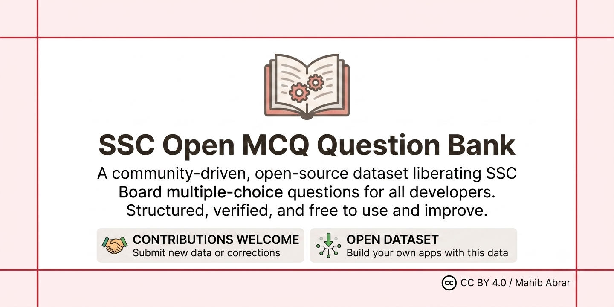

# SSC Open MCQ Question Bank

Welcome to the **SSC Open MCQ Question Bank**, an open-source initiative dedicated to providing a free, verified, and structured repository of SSC multiple-choice questions. Our goal is to empower students with accessible study materials while encouraging community-driven improvements.
## 🚀 Get Involved: How to Contribute
We believe the best study resources are built by the community. Whether you are a student, educator, or developer, your contributions are highly valued:
 * **Submit Corrections**: If you encounter an error in any question, please open an issue or submit a pull request with the correction.
 * **Add New Data**: Help us expand the bank by adding questions from previous board exams following our JSON structure.
 * **Improve the Codebase**: Enhance our validation schemas or build tools to make the data more accessible.
 * **Guidelines**: Please ensure all new submissions align with the definitions found in mcq_question_schema.json.
## 📁 Repository Structure
Our data is organized to ensure modularity, easy maintenance, and scalability:
```text
ssc-open-mcq-bank/
├── LICENCE
├── README.md
├── chapters_schema.json      # Validation schema for chapters
├── mcq_question_schema.json  # Validation schema for MCQs
├── edu_boards.json           # Global registry for education boards
├── subjects.json             # Global index of all subjects
└── {subject_id}/             # e.g., 101/
    ├── chapters.json         # Subject-specific chapter mapping
    └── {year}/               # e.g., 2025/
        ├── mcq_1.json        # Chapter 1 questions
        └── mcq_{chapter_id}.json

```
## 🔍 Directory Breakdown
### Root Configuration
 * **chapters_schema.json**: Defines the required structure for chapter metadata files.
 * **mcq_question_schema.json**: Ensures all MCQ data remains consistent and machine-readable.
 * **edu_boards.json**: Stores metadata and unique identifiers for various education boards.
 * **subjects.json**: Acts as the master registry linking subject IDs (e.g., 101) to subject titles.
### Subject & Temporal Data
 * **/{subject_id}/**: Each subject is isolated in its own directory for easier navigation.
 * **chapters.json**: Located within the subject folder, this file outlines the course content structure.
 * **/{subject_id}/{year}/**: Questions are categorized by academic year to maintain optimized file sizes.
 * **mcq_{chapter_id}.json**: Contains the actual board questions for a specific chapter within that academic year.
## ⚖️ License & Attribution
This project is licensed under the **Creative Commons Attribution 4.0 International (CC BY 4.0)** license.
**Permissions:**
 * You are free to use, share, and adapt this material for any purpose, including commercial projects.
 * You may modify and redistribute the data freely.
**Requirement:**
You must provide appropriate credit to the original author.
**Example Attribution:**
> "SSC Question Bank by Mahib Abrar – CC BY 4.0"
> 
*Disclaimer: Data is aggregated from public exam papers and external sources. We strive for accuracy, but community verification is encouraged.*
